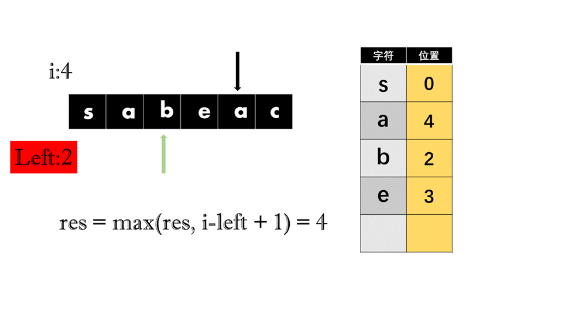

# 48.最长的不重复字串

## 题目描述

>面试题48. 最长不含重复字符的子字符串
请从字符串中找出一个最长的不包含重复字符的子字符串，计算该最长子字符串的长度。

 

示例 1:

>输入: "abcabcbb"
输出: 3 
解释: 因为无重复字符的最长子串是 "abc"，所以其长度为 3。

示例 2:

>输入: "bbbbb"
输出: 1
解释: 因为无重复字符的最长子串是 "b"，所以其长度为 1。

示例 3:

>输入: "pwwkew"
输出: 3
解释: 因为无重复字符的最长子串是 "wke"，所以其长度为 3。
     请注意，你的答案必须是 子串 的长度，"pwke" 是一个子序列，不是子串。


## 解题思路


+ 设每次遍历的位置为i  
+ 设指针left


如上图，我们对字符串进行遍历，如果发现一个字符在之前重复出现过，则将left指针指向这个字符曾经出现位置的后一位，

如下图：



当出现`a`后，发现a与之前的字符有重复，则更新left，跳到上一个`a`的后一位，`i-left+1`则是字符串`bea`的长度。但它不是最长的，前面有字符串`sabe`的长度为4，所以res值没有更新。**<font color = red>值得注意的一点是，更新left的同时要保证新的值要大于left，也就是说left只能前进</font>**

## 代码
```java
 /**
     * 执行用时 :
     * 7 ms
     * , 在所有 Java 提交中击败了
     * 83.90%
     * 的用户
     * 内存消耗 :
     * 39.8 MB
     * , 在所有 Java 提交中击败了
     * 100.00%
     * 的用户
     * @param s
     * @return
     */
    public int lengthOfLongestSubstring(String s) {
        HashMap<Character, Integer> cMap = new HashMap<>();
        int res = 0;
        int left = 0;
        for (int i = 0; i < s.length(); i++) {
            char c = s.charAt(i);
            if (cMap.containsKey(c) && cMap.get(c) + 1 > left) {
                left = cMap.get(c) + 1;
            }
            res = Math.max(res, i - left + 1);
            cMap.put(c, i);
        }
        return res;
    }
```

## 最后

真就画图一小时，解析三分钟。