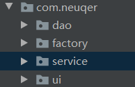
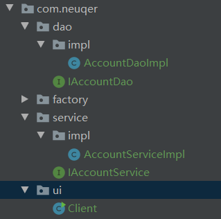

# 代码中的耦合问题及其解耦方式

## 1. 程序之间的耦合

+ 类之间的依赖
+ 方法之间的依赖


### 1.1 示例

访问mysql数据库

```java
public class BackEndDemo1 {


    public static void main(String[] args) {
        //1.注册驱动
       try {
           DriverManager.registerDriver(new com.mysql.jdbc.Driver());
       } catch (SQLException e) {
           e.printStackTrace();
       }
       
        try {
            //2.获取链接
            Connection con = DriverManager.getConnection("jdbc:mysql://localhost:3306/eesy",
                    "root", "xxxxxx");
            //3.获取操作数据库的预处理对象
            PreparedStatement pstm = con.prepareStatement("select * from account");
            //4.执行sql，得到结果集
            ResultSet resultSet = pstm.executeQuery();
            //5.遍历结果集
            while(resultSet.next()) {
                System.out.println(resultSet.getString("name"));
            }
            //6.释放资源
            resultSet.close();
            pstm.close();
            con.close();
        } catch (SQLException e) {
            e.printStackTrace();
        }


    }

}
```

这里存在的问题就是这一句  
`DriverManager.registerDriver(new com.mysql.jdbc.Driver());`

`new com.mysql.jdbc.Driver()` 能够使用的前提就是添加了对mysql的依赖。如果我们没添加依赖的话，编译都无法成功。  
我们要做到的是，一个工程尽量能成功编译，**尽量出现的错误都是运行时的错误，别搞得编译都无法成功。**

那么我们可以利用 `Class.forName(String name)` 方法来将类加载到JVM中。  
[探究一下JDBC中的Class.forName](https://juejin.im/post/5ca1a366e51d455c4a44558f)

也就是用`Class.forName("com.mysql,jdbc.Driver")`来代替 `DriverManager.registerDriver(new com.mysql.jdbc.Driver());` 这也就避免了直接New产生的编译时的错误，报错也只能报运行时错误。

## 2. 业务代码如何减少耦合

原则：

**实体开发:**
>应该做到：编译期不依赖，运行时才依赖  

**解耦的思路：**
>第一步：使用反射创建对象，避免使用new关键字  
第二步：通过读取配置文件来获取要创建的对象的全限定类  

比如一个完整的项目目录包含：
<div align=center></div>


现在先不要看factory包。
dao是对数据库的操作，service暴露给外界对数据库进行操作，client则象征着用户操作。

```java

/**
 * Client层
 * 模拟表现层，用于调用业务层
 */
public class Client {
    public static void main(String[] args) {
       IAccountService as = new AccountServiceImpl();
        as.saveAccount();
    }
}


/**
 * 账户的业务层实现类
 */
public class AccountServiceImpl implements IAccountService {
   private IAccountDao accountDao = new AccountDaoImpl();
    public void saveAccount() {
        accountDao.saveAccount();
    }
}


/**
 * 账户的持久层实现类
 */
public class AccountDaoImpl implements IAccountDao {
    public void saveAccount() {
        System.out.println("保存了账户信息");
    }
}

```

我们可以看到，client层有对service层的引用，service层有对dao层引用，任何一层相关对象的改变或者确实，都会导致项目整体的无法编译。所以为了解决这个问题，我们采用了<font color = red>**工厂方法。**</font>

### 2.1 工厂模式

+ 第一个，需要一个配置文件来配置我们的service和dao  
配置的内容，唯一标识的全限定类名  

+ 第二个，通过读取配置文件的内容，反射创建对象  
 配置文件：xml\properties  
目前选用properties文件

其实我们的目的很简单，就是让用到的类是通过配置文件里的键值对应的，我给你一个名字，但是我能给这个名字配置不同的值，但是对程序本身不需要改动。

如何实现呢？
```properties
# 我们首先书写配置文件，这里我们采用properties文件

# 在resources包下面创建 bean.propeties文件，内容如下

accountService=com.neuqer.service.impl.AccountServiceImpl
accountDao=com.neuqer.dao.impl.AccountDaoImpl

```

创建工厂类：

```java
/**
 * 一个创建Bean对象的工厂
 *
 * Bean有可重用组件的含义
 *
 * JavaBean ≠ 实体类
 * JavaBean:用Java语言编写的可重用的组件
 *          创建service和dao
 *          第一个，需要一个配置文件来配置我们的service和dao
 *            配置的内容，唯一标识的全限定类名
 *          第二个，通过读取配置文件的内容，反射创建对象
 *          配置文件：xml\properties
 *          目前选用properties文件
 */
public class BeanFactory {
    //定义一个Properties对象
    private static Properties props;

    //使用静态代码块为Properties对象赋值
    static {
        try {
            //实例化对象
            props = new Properties();
            //获取properties文件流对象
            InputStream in = BeanFactory.class.getClassLoader().getResourceAsStream("bean.properties");
            props.load(in);
        } catch (Exception e) {
            throw new ExceptionInInitializerError("properties文件加载失败");
        }
    }

    /**
     * 根据Bean的名称获得Bean对象
     * @param beanName: bean名
     * @return 实例化的bean
     */
    public static Object getBean(String beanName) {
        Object bean = null;
        try {
            String beanPath = props.getProperty(beanName);
            bean = Class.forName(beanPath).newInstance();
        } catch (Exception e) {
            e.printStackTrace();
        }
        return bean;
    }
}
```

首先是加载properties文件

其次，需要注意的是，获得实例bean的时候，我们是通过<font color = red>**反射**</font>获得的，反射使用的类名是我们通过配置文件配置的，所以使得解耦成为可能。
这样，在每次调用一些类的时候，我们便不再需要通过new，而是可以通过工厂类来完成实例化：

```java
/**
 * 模拟表现层，用于调用业务层
 */
public class Client {
    public static void main(String[] args) {
        IAccountService as = (IAccountService) BeanFactory.getBean("accountService");
        as.saveAccount();
    }
}
```

而且即使类名错误，也只会报运行时错误，而不会导致无法编译的情况出现。