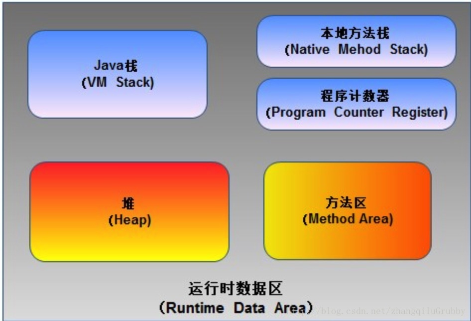

# 栈

## 1. 定义
栈是一种具有后进先出特点的数据结构。LIFO（last in first out）

## 2. 使用

### 2.1 Java的 VM 栈
JVM运行时主要有五个数据区



栈帧随方法的调用而创建，存储着方法种的局部变量等数据，
创建的栈帧会存入VM栈中，当方法执行完，栈帧则会被弹出。方法的递归就是这种思想，方法一次一次地入栈，最后一个栈帧入栈，但它是第一个出栈。

### 2.2 使用栈进行树的深度优先搜索

我们都知道，深度优先搜索可以用递归，但是递归都可以转换成栈的形式，但是用栈来递归树的时候要注意先右子树入栈，后左子树入栈
```java
private static void treeTravel(TreeNode node) {
        stack.push(node);
        while(!stack.isEmpty()) {
            TreeNode temp = stack.pop();
            System.out.println(temp.val);
            if (temp.right != null) {
                stack.push(temp.right);
            }
            if (temp.left != null) {
                stack.push(temp.left);
            }

        }
    }
```


### 2.3 Android中的事件分发机制

<div align = center></img></div>

所有可以处理事件的子View是以链表的形式串联到一起，而且是前序插入，后进先出。

## 3. 实现

### 3.1 顺序存储
```java
public class seqStack<T> {
	
	private T data[];
	private int top;
	public seqStack() {
		data=(T[]) new Object[10];
		top=-1;
	}
	public seqStack(int maxsize)
	{
		data=(T[]) new Object[maxsize];
		top=-1;
	}
	boolean isEmpty()
	{
		return top==-1;
	}
	int length()
	{
		return top+1;
	}
	
	boolean push(T value) throws Exception//压入栈
	{
		if(top+1>data.length-1)
		{
			throw new Exception("栈已满");
		}
		else {
			data[++top]=value;
			return true;
		}
	}
	T peek() throws Exception//返回栈顶元素不移除
	{
		if(!isEmpty())
		{
			return data[top];
		}
		else {
			throw new Exception("栈为空");
		}
	}
	T pop() throws Exception
	{
		if(isEmpty())
		{
			throw new Exception("栈为空");
		}
		else {
		   return data[top--];
		}
	}
	public String toString()
	{
		if(top==-1)
		{
			return "";
		}
		else {
			String va="";
			for(int i=top;i>=0;i--)
			{
				va+=data[i]+"  ";
			}
			return va;
		}
	}
}


作者：bigsai
链接：https://juejin.im/post/5d5386b1f265da03c8151832
来源：掘金
著作权归作者所有。商业转载请联系作者获得授权，非商业转载请注明出处。
```

### 3.2 链表存储
```java
public class lisStack <T>{
	static class node<T>
	{
		T data;
		node next;
		public node() {    
		}
		public node(T value)
		{
			this.data=value;
		}
	}
	int length;
    node<T> head;//头节点
    public lisStack() {
		head=new node<>();
		length=0;
	}
    boolean isEmpty()
	{
		return head.next==null;
	}
	int length()
	{
		return length;
	}
    public void push(T value) {//近栈
       node<T> team=new node<T>(value);
       if(length==0)
       {
    	   head.next=team;
       }
       else {
		team.next=head.next;
		head.next=team;}
       length++;
    }
    public T peek() throws Exception {
        if(length==0) {throw new Exception("链表为空");}
        else {//删除
			return (T) head.next.data;
		}
  }
    public T pop() throws Exception {//出栈
          if(length==0) {throw new Exception("链表为空");}
          else {//删除
        	T value=(T) head.next.data;
			head.next=head.next.next;//va.next
			length--;
			return value;
			
			
		}
    }
    public String toString(){
    	if(length==0) {return "";}
    	else {
			String va="";
		    node team=head.next;
		    while(team!=null)
		    {
		    	va+=team.data+" ";
		    	team=team.next;
		    }
		    return va;
		}
       
    }
}

作者：bigsai
链接：https://juejin.im/post/5d5386b1f265da03c8151832
来源：掘金
著作权归作者所有。商业转载请联系作者获得授权，非商业转载请注明出处。
```

## 4. 示例题目

### 4.1 判断括号是否合理

```java
private static boolean isValid(String res) {
        Stack<Character> stack = new Stack<>();
        for (int i = 0; i < res.length(); i++) {
            char c = res.charAt(i);
            if (isLeft(c)) {
                stack.push(c);
            } else {
                if (stack.isEmpty()) {
                    return false;
                }
                if (!isValid(stack.peek(), c)) {
                    return false;
                } else {
                    stack.pop();
                }
            }
        }
        return stack.isEmpty();
    }

    private static boolean isLeft(char t) {
        return t=='[' || t=='(' || t=='{';
    }

    private static boolean isValid(char left, char right) {
        switch (left) {
            case '[':
                return right == ']';
            case '{':
                return right == '}';
            case '(':
                return right==')';
            default:
                return false;
        }
    }
```

### 4.1 波兰数


```java


/**
 * 逆波兰表示法（Reverse Polish notation，RPN，或逆波兰记法），
 * 是一种是由波兰数学家扬·武卡谢维奇1920年引入的数学表达式方式，
 * 在逆波兰记法中，所有操作符置于操作数的后面，因此也被称为后缀
 * 表示法。 逆波兰记法不需要括号来标识操作符的优先级。
 *
 *
 * 计算逆波兰式（后缀表达式）的值
 * 运算符仅包含"+","-","*"和"/"，被操作数可能是整数或其他表达式
 * 例如：
 *   ["2", "1", "+", "3", "*"] -> ((2 + 1) * 3) -> 9↵
 *
 *   ["4", "13", "5", "/", "+"] -> (4 + (13 / 5)) -> 6
 *
 */


 /**
     * 执行结果：
     * 通过
     * 显示详情
     * 执行用时 :
     * 7 ms, 在所有 Java 提交中击败了82.48%的用户
     * 内存消耗 :
     * 39.1 MB, 在所有 Java 提交中击败了5.47%的用户
     * @param tokens
     * @return
     */
    private static int evalRPN(String[] tokens) {
        if (tokens.length == 1) {
            return Integer.parseInt(tokens[0]);
        }
        Stack<Integer> integerStack = new Stack<>();
        String op;
        int var1;
        int var2;
        int value = -1;
        for (String token : tokens) {
            if (!isOp(token)) {
                integerStack.push(Integer.parseInt(token));
            } else {
                if (!integerStack.isEmpty()) {
                    var1 = integerStack.pop();
                    var2 = integerStack.pop();
                    integerStack.push(value = calculate(var2, var1, token));
                }
            }
        }
        return value;
    }

    private static int calculate(int a, int b, String op) {
        switch (op) {
            case "+":
                return a + b;
            case "-":
                return a - b;
            case "*":
                return a * b;
            case "/":
                if (b == 0) {
                    throw new IllegalArgumentException("除数不能为0");
                }
                return a / b;
            default:
                return -1;
        }
    }

    private static boolean isOp(String op) {
        return op.equals("+") || op.equals("-") || op.equals("*") || op.equals("/");
    }

```